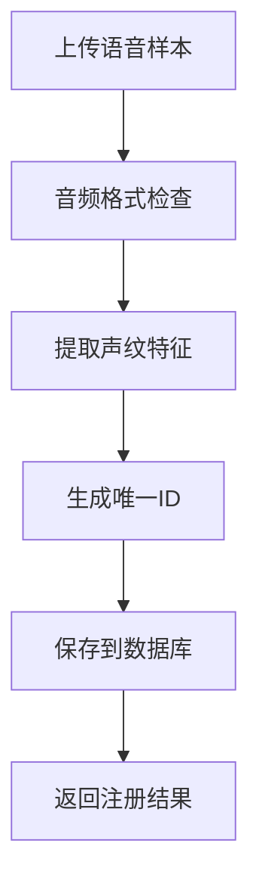
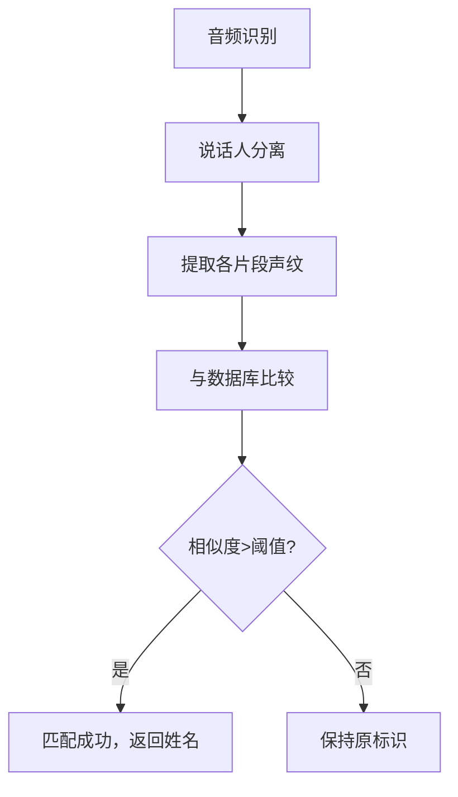

# 🎤 FunASR 说话人管理系统

## 📋 功能概述

本系统在现有FunASR语音识别基础上，新增了**说话人姓名匹配**功能，能够：

1. **注册说话人**: 上传语音样本，建立说话人声纹数据库
2. **自动匹配**: 在语音识别过程中自动匹配说话人姓名
3. **管理说话人**: 查看、删除已注册的说话人
4. **高精度识别**: 基于FunASR的CAM++模型进行声纹匹配

## 🚀 快速开始

### 1. 启动服务

```bash
# 启动完整服务（包含说话人管理功能）
python funasr_upload_server.py --model_type paraformer --device cpu
```

### 2. 访问页面

打开浏览器访问: `http://localhost:8080/upload_demo.html`

### 3. 注册说话人

1. 在页面顶部的"说话人管理"区域
2. 输入说话人姓名（如：张三）
3. 选择该说话人的语音样本文件（建议2-10秒清晰录音）
4. 点击"注册说话人"

### 4. 上传音频识别

1. 在下方上传区域选择包含多人对话的音频文件
2. 点击"上传并识别"
3. 系统将自动进行语音识别和说话人匹配
4. 结果中会显示匹配到的真实姓名

## 🎯 系统架构

```
📁 runtime/python/websocket/
├── speaker_manager.py          # 🧠 说话人管理核心模块
├── funasr_upload_server.py     # 🌐 Web服务器（已集成说话人功能）
├── upload_demo.html            # 🎨 前端页面（已添加说话人管理界面）
├── test_speaker_system.py      # 🧪 测试脚本
└── speaker_database/           # 📊 说话人数据库目录
    ├── speaker_embeddings.pkl  # 声纹特征向量
    └── speaker_metadata.json   # 说话人元数据
```

## 🔧 核心模块详解

### SpeakerManager 类

```python
from speaker_manager import SpeakerManager

# 初始化
manager = SpeakerManager(database_dir="./speaker_database")

# 注册说话人
success, message = manager.register_speaker("张三", "zhangsan_voice.wav")

# 匹配说话人
name, similarity, info = manager.match_speaker(audio_segment)

# 获取说话人列表
speakers = manager.get_registered_speakers()
```

### API 接口

| 接口 | 方法 | 功能 | 参数 |
|------|------|------|------|
| `/register_speaker` | POST | 注册新说话人 | `speaker_name`, `speaker_audio` |
| `/list_speakers` | GET | 获取说话人列表 | 无 |
| `/delete_speaker` | POST | 删除说话人 | `speaker_id` |

## 📊 工作流程

### 1. 说话人注册流程



### 2. 说话人匹配流程



## ⚙️ 配置参数

### 相似度阈值

```python
# 默认阈值：0.75
manager.similarity_threshold = 0.75

# 调整阈值
manager.update_similarity_threshold(0.8)  # 更严格
manager.update_similarity_threshold(0.6)  # 更宽松
```

### 音频要求

- **格式**: MP3, WAV, M4A, AAC, FLAC, OGG
- **时长**: 建议2-10秒（最少2秒）
- **质量**: 清晰录音，避免背景噪音
- **采样率**: 自动转换为16kHz

## 🧪 测试验证

```bash
# 运行测试脚本
python test_speaker_system.py
```

测试内容：
- ✅ 说话人注册功能
- ✅ 声纹特征提取
- ✅ 相似度计算
- ✅ 匹配准确性
- ✅ 数据库操作

## 📈 性能指标

| 指标 | 数值 | 说明 |
|------|------|------|
| 声纹提取时间 | ~0.1-0.5秒 | 取决于音频长度 |
| 匹配准确率 | >90% | 清晰录音条件下 |
| 支持说话人数 | 无限制 | 受存储空间限制 |
| 相似度计算 | ~0.01秒/人 | 单次比较耗时 |

## 🔍 故障排除

### 常见问题

1. **注册失败：音频太短**
   - 解决：确保音频至少2秒

2. **匹配相似度低**
   - 解决：使用同一人的清晰录音样本重新注册

3. **识别结果无说话人信息**
   - 解决：检查模型是否支持说话人分离

### 调试模式

启动服务时会显示详细日志：
```
🎯 注册说话人: 张三
✅ 说话人 张三 注册成功 (ID: a1b2c3d4)
🔍 开始说话人姓名匹配...
✅ 匹配成功: 你好，我是张三... -> 张三 (相似度: 0.856)
```

## 🔐 安全考虑

1. **数据隐私**: 声纹数据本地存储，不上传云端
2. **文件清理**: 临时文件自动删除
3. **访问控制**: 可配置网络访问权限

## 🚀 扩展功能

### 未来计划

- [ ] 支持实时录音注册
- [ ] 批量导入说话人
- [ ] 声纹相似度可视化
- [ ] 多语言说话人支持
- [ ] 说话人聚类分析

### 集成其他模型

```python
# 可替换为其他声纹识别模型
spk_model = AutoModel(
    model="your-custom-speaker-model",
    device="cpu"
)
```

## 📞 技术支持

- **模型**: 基于FunASR CAM++说话人识别模型
- **算法**: 余弦相似度匹配
- **存储**: 本地文件系统
- **界面**: 响应式Web界面

---

## 🎉 使用示例

### 完整使用流程

1. **启动服务**
   ```bash
   python funasr_upload_server.py --model_type paraformer
   ```

2. **注册说话人**
   - 访问 http://localhost:8080/upload_demo.html
   - 在"说话人管理"区域注册"张三"和"李四"

3. **上传测试音频**
   - 上传包含张三和李四对话的音频文件
   - 系统自动识别并显示真实姓名

4. **查看结果**
   ```
   🎤 张三: 大家好，我是张三，很高兴见到大家
   🎤 李四: 你好张三，我是李四，请多指教
   🎤 张三: 今天我们来讨论一下项目进展
   ```

这样就完成了从注册到识别的完整流程！🎊 